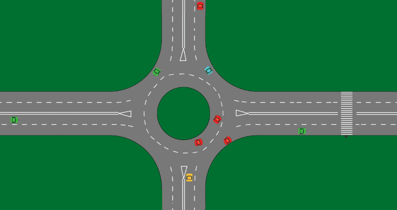

# Autonomous Car Interaction at Roundabouts

## Concept

This project aims to implement a roundabout with multiple lanes and entrances/exits and vehicles behave independently and concurrently.
The Roundabout is the main structure of this project, contains the main logic like car detection,  calculation of the shortest path, etc. For representing the road network we used a directed graph which allow us to represent all vertices of the network. 

## GUI

**Development Date:** June 2019

## Author

* Filipe Mesquita - [filipemes](https://github.com/filipemes)
* Tiago Cardoso
* João Moreira
